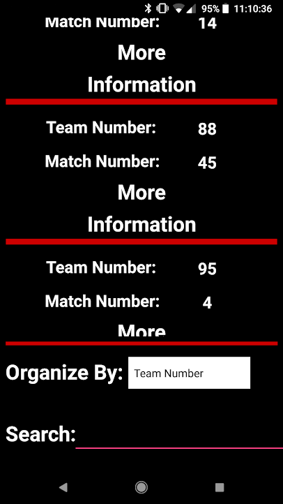

|  |<h1>FRC Scouting</h1>| 
| :---         |     :---:      | 

## Table of Contents

- [Overview](#Overview)
- [Screenshots](#Screenshots)
- [How to Play on Your Device](#how-to-play-on-your-device)
- [Features](#Features)
- [Cool Things about the App](#cool-things-about-the-app)
- [Technologies Used](#technologies-used)
- [Acknowledgements](#acknowledgements)

## Overview

[FRC Scouting](https://play.google.com/store/apps/details?id=com.team6378.thanu.frcmanager) is an Android app that allowed teams to scout opponents, create strategies against key teams and rank teams for alliance selection for the 2018 FIRST Robotics Competition: FIRST Power Up. The app on the Google Play Store will always remain in Alpha because our team vowed we would completely release the app once we made it to Worlds but sadly, we did not. Thus, it will always remain in Alpha.

## Screenshots

 
 
  
 

## How to Play on Your Device

You can simply click on the hyperlink of FRC Scouting in the [Overview](#Overview) section or [click here](https://play.google.com/store/apps/details?id=com.team6378.thanu.frcmanager) to download the app from the Google Play Store. 

Alternatively, you can clone this repository and open it up in Android Studio. Then simply load the app to you Android device by clicking the green play button on the top-right side of the IDE (assuming no compilation erros :D).

## Features

- Keeps track of data for each competition you attend
- Organizes your match data based on the core features of this year's game
- Search for the teams that interest you most through the piles of data you collect
- Has complete offline support and uses Bluetooth to send data between phones
- Export your data to an Excel file
- Allows you to take pictures of robots for scouting purposes

## Cool Things about the App
- Designed a pipeline to send data between phones via Bluetooth and export data to a Spreadsheet
- Built a ranking system that would categorize opponents in 3 distinct groups based off user preferences
- Created algorithms for tabulating game data and developed searching capabilities to allow easy access
to specific match or team statistics

## Technologies Used

- [Android Studio](https://developer.android.com/studio) - IDE used to build the game
- [Java](https://www.java.com/en/download/) - Programming language used (Created the app when I was new to programming, so I used Java instead of Kotlin)

## Acknowledgements

- Thanks to my Team 6378 for supporting this app!
